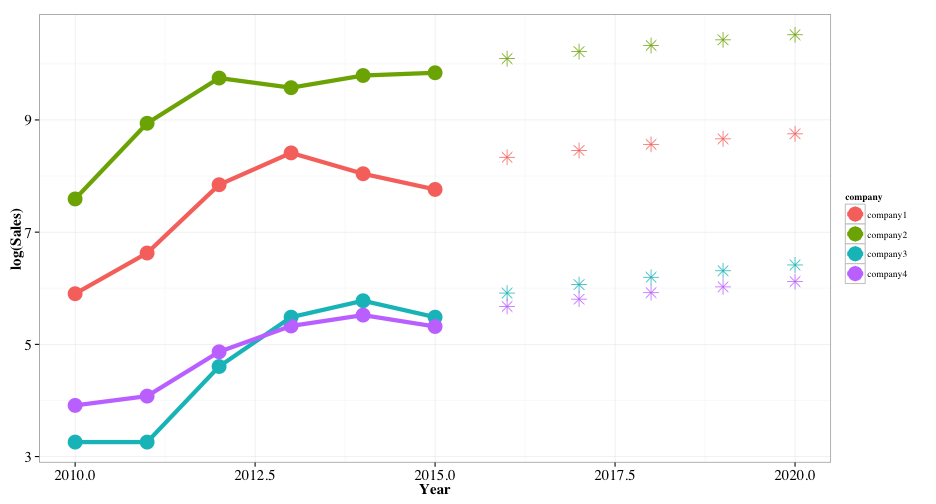

## Introduction
This presentation is produced using slidfy app. In this project I am using synthetic sale data.
The data set consists of yearly sales of 4 ficticious companies (named Company 1, Company 2, Company 3 and Company 4).
We fit the linear regression model using year and company as covariate and sales as response variable.


---
## Data Summary

```r
str(sales_data)
```

```
## 'data.frame':	24 obs. of  3 variables:
##  $ year   : num  2010 2011 2012 2013 2014 ...
##  $ company: Factor w/ 4 levels "company1","company2",..: 1 1 1 1 1 1 2 2 2 2 ...
##  $ sales  : num  366 756 2554 4504 3106 ...
```

```r
summary(sales_data)
```

```
##       year          company      sales        
##  Min.   :2010   company1:6   Min.   :   26.0  
##  1st Qu.:2011   company2:6   1st Qu.:  185.5  
##  Median :2012   company3:6   Median :  344.5  
##  Mean   :2012   company4:6   Mean   : 3886.7  
##  3rd Qu.:2014                3rd Qu.: 3455.5  
##  Max.   :2015                Max.   :18785.0
```


--- .class #id 
## Linear Regression Model


```r
model <- glm(sales ~ year * factor(company), data = sales_data)
```
<!-- html table generated in R 3.2.0 by xtable 1.7-4 package -->
<!-- Sun Nov 22 01:51:34 2015 -->
<table border=1>
<tr> <th>  </th> <th> Estimate </th> <th> Std. Error </th> <th> t value </th> <th> Pr(&gt;|t|) </th>  </tr>
  <tr> <td align="right"> (Intercept) </td> <td align="right"> -1085052.6667 </td> <td align="right"> 879262.6364 </td> <td align="right"> -1.23 </td> <td align="right"> 0.2350 </td> </tr>
  <tr> <td align="right"> year </td> <td align="right"> 540.2857 </td> <td align="right"> 436.9005 </td> <td align="right"> 1.24 </td> <td align="right"> 0.2341 </td> </tr>
  <tr> <td align="right"> factor(company)company2 </td> <td align="right"> -5346294.6667 </td> <td align="right"> 1243465.1453 </td> <td align="right"> -4.30 </td> <td align="right"> 0.0006 </td> </tr>
  <tr> <td align="right"> factor(company)company3 </td> <td align="right"> 964059.6667 </td> <td align="right"> 1243465.1453 </td> <td align="right"> 0.78 </td> <td align="right"> 0.4495 </td> </tr>
  <tr> <td align="right"> factor(company)company4 </td> <td align="right"> 1003610.0000 </td> <td align="right"> 1243465.1453 </td> <td align="right"> 0.81 </td> <td align="right"> 0.4314 </td> </tr>
  <tr> <td align="right"> year:factor(company)company2 </td> <td align="right"> 2661.8571 </td> <td align="right"> 617.8707 </td> <td align="right"> 4.31 </td> <td align="right"> 0.0005 </td> </tr>
  <tr> <td align="right"> year:factor(company)company3 </td> <td align="right"> -480.0857 </td> <td align="right"> 617.8707 </td> <td align="right"> -0.78 </td> <td align="right"> 0.4485 </td> </tr>
  <tr> <td align="right"> year:factor(company)company4 </td> <td align="right"> -499.7429 </td> <td align="right"> 617.8707 </td> <td align="right"> -0.81 </td> <td align="right"> 0.4305 </td> </tr>
   </table>


--- .class #id 

## Plot of sales data.

Note: dotted line indicates predicted data.



